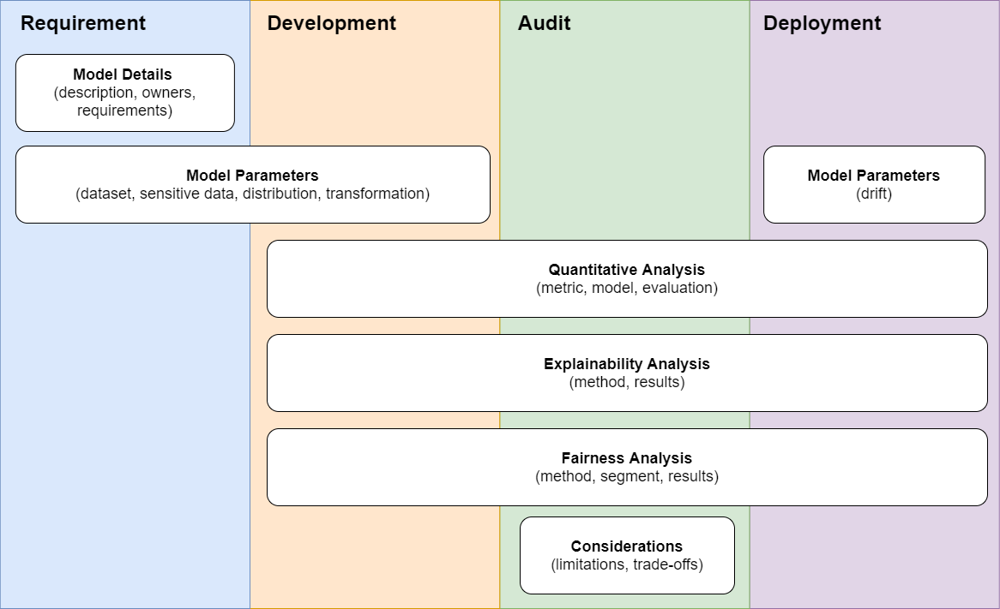

# VerifyML

VerifyML is an opinionated, open-source toolkit and workflow to help companies implement human-centric AI practices. It is built on 3 principles:

- A git and code first approach to model development and maintenance.
- Automatic generation of model cards - machine learning documents that provide context and transparency into a model's development and performance.
- Model tests for validating performance of models across protected groups of interest, during development and in production.

## Workflow



The VerifyML workflow starts from model conceptualization, to model building and deployment. In a typical data science workflow, a model is developed by a data scientist with inputs from the business team. The model optimizes for business objectives without considerations of side effects, differential benefits and harms across groups, and performance degradation over time.

The VerifyML workflow introduces these concepts and trade-offs as part of the model lifecycle. By bringing these questions to the fore, teams gain the following benefits:

- Better clarity on of a model's outcome, potential side-effects, and areas of uncertanity
- Faster alignment across model builders, product owners and internal auditors
- Oversight and accountability

These qualitative inputs then get translated to code (where possible) and act as modelling constraints or considerations. The model card captures and logs artifacts relevant in the model development phase and allow such information to be easily shared across the organization.  

Tests relating to performance or fairness can also be included to ensure that the model meets the desired objective. This can be added to a CI/CD process where such tests are run on a regular basis to ensure that there is no unexpected drift in performance.

## Installation

The Model Card Toolkit is hosted on [PyPI](https://pypi.org/project/verifyml/), and can be installed with `pip install verifyml`.

## Getting Started

### Generate a model card

You can bootstrap a model card with our [tally web form](https://tally.so/r/mR4Nlw) or generate it with the python toolkit:

```py
import verifyml.model_card_toolkit as mctlib

# Initialize the Model Card Toolkit with a path to store generate assets
mct = mctlib.ModelCardToolkit(output_dir="model_card_output", file_name="breast_cancer_diagnostic_model_card")
model_card = mct.scaffold_assets()
```

### Populate the model card with details

```py
# You can add free text fields
model_card.model_details.name = 'Breast Cancer Wisconsin (Diagnostic) Dataset'

# Or use helper classes
model_card.model_parameters.data.append(mctlib.Dataset())
model_card.model_parameters.data[0].graphics.description = (
  f'{len(X_train)} rows with {len(X_train.columns)} features')
model_card.model_parameters.data[0].graphics.collection = [
    mctlib.Graphic(image=mean_radius_train),
    mctlib.Graphic(image=mean_texture_train)
]
```

### Save and export to html

```py
html = mct.export_format(output_file="example.html")
display.display(display.HTML(html))
```

## Model Tests

Model tests provides an out of the box way to conduct checks and analysis on performance, explainability and fairness. The tests included in VerifyML are atomic functions that can be imported and run without a model card. However, by using it with a model card, it provides a way to standardize objectives and check for intended or unintended model biases. It also automates documentation and renders the insights to a business friendly report.

Currently, VerifyML provides 5 classes of tests:

1) __Subgroup Disparity Test__ - For a given metric, assert that the difference between the best and worst performing group is less than a specified threshold
2) __Min/Max Metric Threshold Test__ - For a given metric, assert that all groups should be below / above a specified threshold
3) __Perturbation Test__ - Assert that a given metric does not change significantly after perturbing on a specified input variable
4) __Feature Importance Test__ - Assert that certain specified variables are not included as the top n most important features  
5) __Data Shift Test__ - Assert that the distributions of specified attributes are similar across two given datasets of interest

The detailed [model tests readme](/verifyml/model_tests/README.md) contains more information on the tests.

### Example usage

```py
from verifyml.model_tests.FEAT import SubgroupDisparity

# Ratio of false positive rates between age subgroups should not be more than 1.5
sgd_test = SubgroupDisparity(metric='fpr', method='ratio', threshold=1.5)
sgd_test.run(output) # test data with prediction results
sgd_test.plot(alpha=0.05)
```

### Adding the test to the model card

```py
import verifyml.model_card_toolkit as mctlib

mc_sgd_test = mctlib.Test()
mc_sgd_test.read_model_test(sgd_test)
model_card.fairness_analysis.fairness_reports[0].tests = [mc_smt_test]
```

## Schema

Model cards are stored as a protobuf format. The reference model card protobuf schema can be found in the [proto directory](verifyml/model_card_toolkit/proto/model_card.proto). A translated copy in json schema format is also made available for convenience in the [schema folder](verifyml/model_card_toolkit/schema)

## Contributions and Development

Contributions are always welcome - check out [CONTRIBUTING](CONTRIBUTING.md)

The package and it's functionalities can be easily extended to meet the needs of a team. Check out [DEVELOPMENT](DEVELOPMENT.md) for more info.

## Prior Art

The model card in VerifyML is adapted from Google's [Model Card Toolkit](https://github.com/tensorflow/model-card-toolkit). It is backward compatible with v0.0.2 and expands on it by adding sections on explainability and fairness.  

## References

[1] https://arxiv.org/abs/1810.03993

## License

VerifyML is licensed under the Apache License, Version 2.0. See [LICENSE](LICENSE.md) for the full license text.
